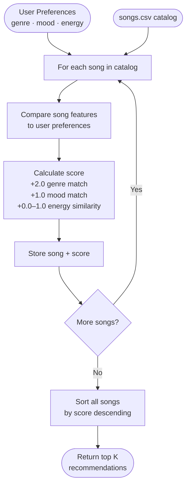
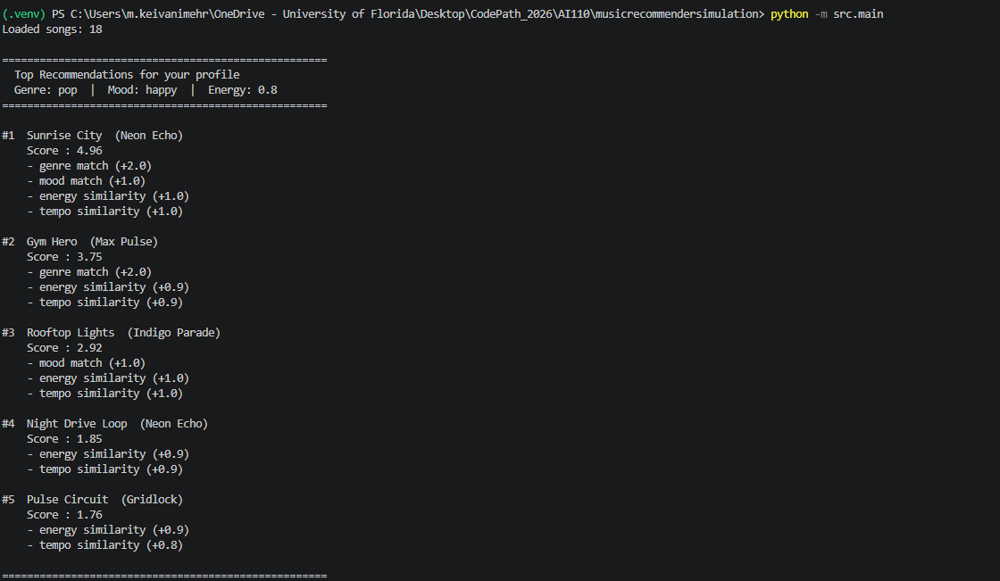

# 🎵 Music Recommender Simulation

## Project Summary

In this project you will build and explain a small music recommender system.

Your goal is to:

- Represent songs and a user "taste profile" as data
- Design a scoring rule that turns that data into recommendations
- Evaluate what your system gets right and wrong
- Reflect on how this mirrors real world AI recommenders

---

## How The System Works

Real-world music recommenders like Spotify or Apple Music combine two types of signals: what a song *is* (its genre, tempo, mood, and acoustic qualities) and what *people like you* have historically enjoyed. This project focuses on the first approach — content-based filtering — which means every recommendation is driven by how closely a song's measurable features match a user's stated preferences. The system scores each song in the catalog using a weighted formula that rewards genre and mood matches most heavily, then uses energy closeness as a continuous tiebreaker. Songs are ranked by that score and the top results are returned. This version prioritizes transparency and simplicity: every recommendation can be explained in plain language, and the weights are visible constants that can be tuned to change how the system behaves.

**System Flowchart**



> The `.mmd` source for this diagram is saved at [`recommender_flow.mmd`](recommender_flow.mmd).

**Algorithm Recipe**

This is the step-by-step scoring logic the recommender follows for every song:

```
score = 0.0

1. Genre match:
   if song.genre == user.favorite_genre → score += 2.0

2. Mood match:
   if song.mood == user.favorite_mood   → score += 1.0

3. Energy similarity:
   energy_sim = 1.0 - abs(song.energy - user.target_energy)  # always 0.0–1.0
   score += energy_sim * 1.0                                  # max contribution: +1.0

Maximum possible score: 4.0
```

**How the Recommender computes a score**

Each song is scored independently against the user profile using a weighted formula. Genre and mood each produce a 0 or 1 depending on whether they match the user's preference. Energy produces a closeness value between 0 and 1, where 1 means a perfect match and the score decreases linearly as the song's energy drifts from the user's target. Each result is multiplied by its weight and summed. The maximum possible score is 4.0 (genre + mood + full energy match), so you can optionally normalize by dividing by 4.0 to get a value between 0 and 1.

**How the system chooses which songs to recommend**

After every song in the catalog is scored, the system sorts all songs from highest to lowest score and returns the top `k` results (default is 5). Songs with equal scores keep their original catalog order. The final list is what the user sees as their recommendations.

**Potential Biases to Watch For**

- **Genre dominance.** Because genre is worth twice as much as mood, songs in the wrong genre but with a perfect mood and energy match will almost always lose to a genre match with poor mood and energy. A great song in a neighboring genre (e.g., `indie pop` when the user wants `pop`) will be systematically underranked.
- **Sparse catalog problem.** With only 18 songs and 15 distinct genres, genre matches are rare. When no genre match exists, the ranking collapses to mood + energy — which may not reflect what the user actually wants.
- **Energy is always rewarded.** Even a song with 0.5 energy difference still earns 0.5 points. No song is ever penalized to zero on energy alone, which means poor-fit songs can still rank ahead of slightly better alternatives if the catalog has no categorical matches.
- **Mood is binary.** A song labeled `chill` and one labeled `relaxed` are treated as completely different, even though a human listener would find them similar. This can make the system feel overly strict.

**Song features used in scoring**

- `genre` — categorical; binary match against the user's favorite genre (+2.0)
- `mood` — categorical; binary match against the user's favorite mood (+1.0)
- `energy` — float 0–1; scored by closeness to the user's target energy level (+0.0 to +1.0)
- `tempo_bpm`, `valence`, `danceability`, `acousticness`, `instrumentalness`, `liveness` — stored but not currently scored; available for future experiments
- `title`, `artist`, `id` — metadata only; used for display, not scoring

**UserProfile fields**

- `favorite_genre` — the genre the user most consistently listens to
- `favorite_mood` — the mood setting the user prefers, such as chill or focused
- `target_energy` — float 0–1 representing how high- or low-energy the user wants songs to feel


---

## Getting Started

### Setup

1. Create a virtual environment (optional but recommended):

   ```bash
   python -m venv .venv
   source .venv/bin/activate      # Mac or Linux
   .venv\Scripts\activate         # Windows

2. Install dependencies

```bash
pip install -r requirements.txt
```

3. Run the app:

```bash
python -m src.main
```

### Running Tests

Run the starter tests with:

```bash
pytest
```

You can add more tests in `tests/test_recommender.py`.

---

## Experiments You Tried

Use this section to document the experiments you ran. For example:

- What happened when you changed the weight on genre from 2.0 to 0.5
- What happened when you added tempo or valence to the score
- How did your system behave for different types of users

---

## Limitations and Risks

Summarize some limitations of your recommender.

Examples:

- It only works on a tiny catalog
- It does not understand lyrics or language
- It might over favor one genre or mood

You will go deeper on this in your model card.

---

## Reflection

Read and complete `model_card.md`:

[**Model Card**](model_card.md)

Write 1 to 2 paragraphs here about what you learned:

- about how recommenders turn data into predictions
- about where bias or unfairness could show up in systems like this


---

## 7. `model_card_template.md`

Combines reflection and model card framing from the Module 3 guidance. :contentReference[oaicite:2]{index=2}  

```markdown
# 🎧 Model Card - Music Recommender Simulation

## 1. Model Name

Give your recommender a name, for example:

> VibeFinder 1.0

---

## 2. Intended Use

- What is this system trying to do
- Who is it for

Example:

> This model suggests 3 to 5 songs from a small catalog based on a user's preferred genre, mood, and energy level. It is for classroom exploration only, not for real users.

---

## 3. How It Works (Short Explanation)

Describe your scoring logic in plain language.

- What features of each song does it consider
- What information about the user does it use
- How does it turn those into a number

Try to avoid code in this section, treat it like an explanation to a non programmer.

---

## 4. Data

Describe your dataset.

- How many songs are in `data/songs.csv`
- Did you add or remove any songs
- What kinds of genres or moods are represented
- Whose taste does this data mostly reflect

---

## 5. Strengths

Where does your recommender work well

You can think about:
- Situations where the top results "felt right"
- Particular user profiles it served well
- Simplicity or transparency benefits

---

## 6. Limitations and Bias

Where does your recommender struggle

Some prompts:
- Does it ignore some genres or moods
- Does it treat all users as if they have the same taste shape
- Is it biased toward high energy or one genre by default
- How could this be unfair if used in a real product

---

## 7. Evaluation

How did you check your system

Examples:
- You tried multiple user profiles and wrote down whether the results matched your expectations
- You compared your simulation to what a real app like Spotify or YouTube tends to recommend
- You wrote tests for your scoring logic

You do not need a numeric metric, but if you used one, explain what it measures.

---

## 8. Future Work

If you had more time, how would you improve this recommender

Examples:

- Add support for multiple users and "group vibe" recommendations
- Balance diversity of songs instead of always picking the closest match
- Use more features, like tempo ranges or lyric themes

---

## 9. Personal Reflection

A few sentences about what you learned:

- What surprised you about how your system behaved
- How did building this change how you think about real music recommenders
- Where do you think human judgment still matters, even if the model seems "smart"

